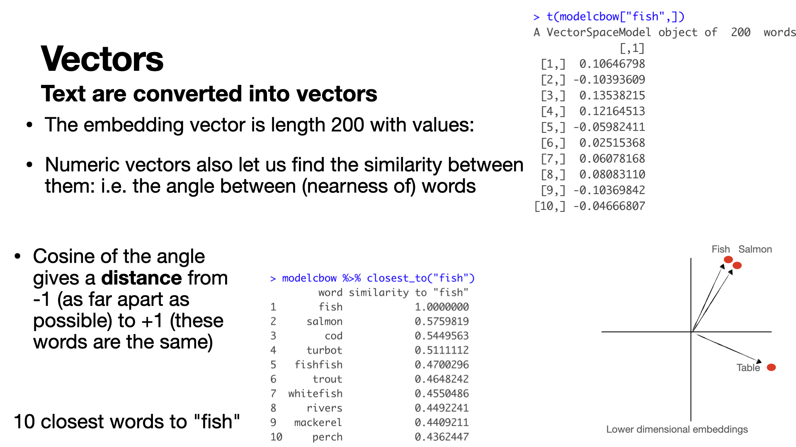

## Sentiment-Analysis

Dave Campbell


#### All materials are on github: 

[github.com/iamdavecampbell/tibble_house_on_the_prairie](https:github.com/iamdavecampbell/tibble_house_on_the_prairie)

Feel free to fork, star, download, correct typos,...

### All the libraries used in this presentation.

```{r, eval = FALSE, message = FALSE}
# packages used 
install.packages(c("tidyverse","tidytext","dplyr",
                    "stringr","janitor","lubridate",
                    "qdap","tools"))
# packages mentioned:
install.packages(c("text2vec","textdata", "word2vec"))
```


## Today


### Hands On, let's run together
- Sentiment Analysis from a lexicon
- Sentiment Analysis considering nearby words for negation, amplification, deamplification,...

### Hands-Waving
- Using Word Embeddings: basic concepts, plenty of potential, plenty of danger

### Hands-Off Research in Statistical Language Processing
- Is there a region effect for the language used to describe Canadian beer flavours?


## Load libraries:

```{r,  eval = FALSE, message = FALSE}
library(tidyverse) ## of course we're using tidyverse
library(tidytext) ## some text tools, basic sentiment analysis
library(dplyr) 
library(stringr) #handling strings
library(janitor) ## make tables look nice
library(lubridate) ## deal with dates
library(qdap) ## handle polarization for sentiment analysis
library(tools) ## to make one plot title look nice
library(text2vec)## will use if we get to word embeddings
library(textdata)## will use if we get to word embeddings
library(word2vec)## will use if we get to word embeddings
```


## R Version


Note that I am using R>4.1 which gives me access to the **|>** operator.  For reproducibility this is the R version that I am using.
```{r, eval = TRUE}
version
```


 

## Basic workflow
- Decide what you want to do.
- Come up with a plan.
- Gather appropriate data
- Split into the units of observation.  Sometimes these are documents, Tweets, speeches, or sentences.
- Tokenize the observations into subunits of interest, typically these are words.
- Analyze!

### Problem:

Is there a difference in the sentiment in Bank of Canada speeches given to the House of Commons Standing Committee on Finance?  Let's compare 2018 vs 2022.


 

##  Sentiment Analysis

### The goal is to infer the emotional meaning behind the authors words.  
- In the 1980s Robert Plutchik created a classification framework for emotions based on 2 evolutionarily created emotions **{anger, disgust, sadness, surprise, fear, trust, joy, anticipation}**.  
- Other emotions are combinations of these.  
- Classifying text according to these emotions is challenging and often subjective.  
- Instead people often use polarity **(positive, neutral, negative)**.  
- Overall these tend to be easier and have higher annotator agreement.  


 

## Sentiment Analysis Typical Strategies


### **Easy** 
Use a lexicon of positive / negative words and count occurence within each article. 

 - This is quick and easy, but it is hard to get a lexicon that is really tuned to your goals and era.  

 - By default this ignores context 
( _costs *fell*_ "+", _profits *fell*_ "-")

 - And modifiers ( _my French comprehension is *not bad*_ "+", _my French spelling is *not good*_ "-").

 

## Sentiment Analysis Typical Strategies


### **Medium** 
Modify a lexicon by editing some terms, looking for modifiers and/or merging terms that could be considered a single word "Data_Science". 

- This requires some hands on effort and domain expertise.  You'll need to read some of the text.  

- This might involve searching for modifiers, such as *not* within a few words of *bad*.  

-  This is equivalent to manually adding some structure to the model.

- Note that pre-processing typically makes a lot of improvements but almost always introduces some undesirable effects. 

 

## Sentiment Analysis Typical Strategies


### **Harder**
- Label some sentences as positive / negative and build a model to figure out what it is about the sentences that define their sentiment.  
- Often start from something like a pre-trained *Word Embedding* model to convert the text to numbers then use a regression-type model (neural net or boosting?) to predict sentiment.  
- Typically you need a lot of data. 
- This is much better for paying attention to context, but costs more effort (labelling data and training the model).  
- Relies on having a well-trained (possibly domain specific) *Word Embedding* model and making sure that the model isn't amplifying biases.


 

## Some Data

### Can we scrape it?

Take a look at using Bank of Canada speeches.

- The [https://www.bankofcanada.ca/robots.txt](https://www.bankofcanada.ca/robots.txt) file looks like we aren't disallowed.  

- The other place to look for permission is in the webpage [terms and conditions](https://www.bankofcanada.ca/terms/).  

We can use Bank of Canada speeches as long as we provide them free of charge (or otherwise obtain the Bank's permission) and attribute the Bank of Canada as the source.  We must also **exercise due diligence in ensuring the accuracy of any content**.

 

## Subset to consider

- Speeches for the House of Commons Standing Committee on Finance in 2018 vs 2022 so far.  Note that this is only 2 speeches per year. 
- We could compare one speech from each, but in what follows we end up with low counts in some categories.  We could get around this by combining sentiment categories, but taking more speeches also provides a snapshot of the economy.

 

---
### New Speeches
- \small [https://www.bankofcanada.ca/2022/04/opening-statement-250422/](https://www.bankofcanada.ca/2022/04/opening-statement-250422/)
- \small [https://www.bankofcanada.ca/2022/03/opening-statement-030322/](https://www.bankofcanada.ca/2022/03/opening-statement-030322/)

### Old Speeches   
- \small [https://www.bankofcanada.ca/2018/10/opening-statement-october-30-2018/](https://www.bankofcanada.ca/2018/10/opening-statement-october-30-2018/)
- \small [https://www.bankofcanada.ca/2018/04/opening-statement-april-23-2018/](https://www.bankofcanada.ca/2018/04/opening-statement-april-23-2018/)


#### Want More? 
Ask Me later about webscraping details if you like.

### Load the data
```{r,eval = FALSE, message = FALSE, warning = FALSE, results='hide'}

new_speeches = read_csv(file = "new_speeches.csv")
old_speeches = read_csv(file = "old_speeches.csv")


```


 

##  Lexicons for Sentiment Analysis

- Lexicons are a list of words with an associated sentiment.  
- Although the English language has a few hundred thousand words, typically sentiment lexicons have only a few thousand words.  
- In most cases people  convey information using a fairly small subset of language, so lexicons tend to do well most of the time. 
- The idea is to  match terms to a sentiment lexicon.  These have been built for a specific purpose, but hopefully such a sentiment will be useful for us.
- The best is to build your own lexicon that suits your needs, but that's expensive and slow. 

**There is no way of separating out data cleaning from data analysis.**


 

## Popular Lexicons


- AFINN from Finn Årup Nielsen,
- bing from Bing Liu and collaborators, 
- Loughran-McDonald Financial dictionary,
- nrc from Saif Mohammad and Peter Turney at the National Research Council of Canada.

 

## AFINN

### Gives words a score between -5 and +5 rating its severity of positive or negative sentiment.

```{r, eval = FALSE}
tidytext::get_sentiments("afinn")
get_sentiments("afinn") |>
      ggplot(aes(x = value))+
   geom_histogram()
```

 

## Bing

### Gives a binary value of positive or negative. Neutral words are not in the list.
```{r, eval = FALSE}
tidytext::get_sentiments("bing")
get_sentiments("bing") |>
   ggplot(aes(x = sentiment, fill = sentiment))+
   geom_bar()+
   theme(axis.text.x = element_text(angle = 90, 
                            vjust = 0.5, hjust=1))+
   theme(legend.position = "none")

```


 

## Loughran-McDonald

Lexicon of negative, positive, uncertainty, litigious, strong modal, weak modal, and constraining terms from the Loughran-McDonald financial dictionary see [here](https://sraf.nd.edu/loughranmcdonald-master-dictionary/)

```{r, eval = FALSE}
## The format is a list:
## Convert it as a data.frame / tibble
LMlex = rbind(
   cbind(SentimentAnalysis::DictionaryLM$positive, "positive"),
   cbind(SentimentAnalysis::DictionaryLM$negative, "negative"),
   cbind(SentimentAnalysis::DictionaryLM$uncertainty, "uncertainty")) 
colnames(LMlex) = c("term", "polarity")
LMlex = LMlex |>as_tibble()
```

```{r, eval = FALSE}

LMlex |>
   ggplot(aes(x = polarity, fill = polarity))+
   geom_bar()+
   theme(axis.text.x = element_text(angle = 90, vjust = 0.5, hjust=1))+
   theme(legend.position = "none")
   

```

 

## NRC


### Puts each word into categories based on the evolutionarily created emotions.
```{r, eval = FALSE}
tidytext::get_sentiments("nrc")
get_sentiments("nrc") |>
   ggplot(aes(x = sentiment, fill = sentiment))+
   geom_bar()+
   theme(axis.text.x = element_text(angle = 90, vjust = 0.5, hjust=1))+
   theme(legend.position = "none")
```


 

## Lexicons


Note that each lexicon has a different length and words might evolve in meaning over time.  

- **Sick** used to be bad, then it was good, now it's so bad that we spent two years _staying the blazes home_.


 

## Sentiment


Back to sentiments, let's count the _nrc_ category occurences:

```{r, eval = FALSE}

Speeches = rbind(new_speeches,old_speeches) |>
         mutate(date = year(date) )|> ## simplify date to just the year
         unnest_tokens(output = word,input = speech_text,
                       token = "words") |>
         inner_join(get_sentiments("nrc") )

#Count the occurrence with each speech
Sents = Speeches |> group_by(date) |> count(sentiment)

Sents |> summarise(sum(n))

Sents |> filter(!(sentiment =="positive"|sentiment=="negative")) |>
ggplot(aes(fill=sentiment, y=n, x=as.factor(date))) + 
    geom_bar(position="fill", stat="identity")+
    xlab("date")
```


 

## Statistical Test


Consider the Null Hypothesis that economic speeches have same sentiment distribution between 2018 and 2022.  

- The alternative is that there is an unspecified difference in distribution.  This can be tested through a Chi-Square test for categorical distributions with $N_r$ rows and $N_c$ columns.

- With observed counts $O_{ij}$ in row $i$ and column $j$ of the table, the Expected counts are the data assuming the only difference is the total count; 
\[E_{ij}= (\mbox{row i total*column j total}) / N_{total}\]


- This gives the test statistic:
\[X = \sum_{i=1}^{N_r}\sum_{j=1}^{N_c}\frac{(O_{ij}-E_{ij})^2}{E_{ij}}\sim \chi^2_{(N_r-1)*(N_c-1)}\]


 

## In Practice

- Remove the categories "positive" and "negative" since these are supersets of the other _nrc_ categories.


- The basic assumption is that these speeches are 'bags of words' that speeches are literally random samples of words rather than prose.  Essentially the Bank of Canada has some sentiment distribution at a given time and the words used in speeches are a random sample thereof.


- This is really just illustrative of how to analyze two time points, but related tools could track extend to regression or time series tools and consider all speeches.

 

## In R:

Cross-tab table

T his counts the occurences, so we don't use the 'summed' table but instead use the tibble that we joined on the sentiments.


```{r, eval = FALSE}


MyTable = janitor::tabyl(
   Speeches|> 
      filter(!(sentiment =="positive"|sentiment=="negative")) |>
      group_by(date),
   sentiment,date)

```


 

## Janitor Detour
 
The janitor library makes it easy to build tables that look nice and can format data with row or column percents and counts.  As a side note it also can put in row / column / total percentages, 

```{r, eval = FALSE}

MyTable |> adorn_totals("row") ## add a row for totals

## report column percentages rather than counts
MyTable |> adorn_percentages("col")
## report percentage of total and also counts
MyTable |> adorn_percentages("all")|>  adorn_ns() 

```


 

## The Statistical Test: 
 
```{r, eval = FALSE}
#Chi-Square test:
chisq.test(MyTable)


```
### Note 

when the counts within a table category are small, generally <5, the results may not be accurate.  

- It might make more sense to combine a few sentiments for the purposes of the test.
- We got around this by using more speeches. 


 

## Going further

Improving the lexicon by considering negation

Using a lexicon, consider the phrase: 

- "This workshop is not too bad."  

A lexicon based approach would see the word **bad** and consider the sentence to be negative, whereas **not bad** is actually pretty good all things considered.


 

## qdap
 
- Library **qdap** searches for the positive or negative **word** and then builds a window around it: **[word-4,word+2]**.  

- Within that window it labels words as **neutral words**, **negators**, **amplifiers**, or **de-amplifiers** 


###  Word lists:

It's worthwhile to check out the word lists and make sure that they are suitable.  Pre-processing choices impact analysis.

```{r, eval = FALSE, message = FALSE }
qdapDictionaries::amplification.words
qdapDictionaries::deamplification.words
qdapDictionaries::negation.words

```


## Let's try it out
 
Use a binary lexicon such as LMlex or bing

-  Start by defining the basic polarity lexicon:
```{r, eval = FALSE}

## inputs are a vector of positives, vector of negatives,...
positives = LMlex  |> filter(polarity =="positive") |> pull(term)
negatives = LMlex  |> filter(polarity =="negative") |> pull(term)
## this is a great place to add in more terms...
negatives = c(negatives, "invasion", "war", "uncertainty",
              "upheaval","anxious", "risk", "tensions","tension")
positives = c(positives, "solid", "reassuring")

## put them into the sentiment lookup hash table
## note that we could set the positive and negative weights:
polarity_frame = sentiment_frame(positives, negatives)
```


## qdap
- A polarized word starts with a score of $X_i=\pm 1$.

- The amplifier / deamplifier weight is by default $.8$.

- The number of negator words, $N_{Negator}$ flip the sign.  

-  The polarity score for a word in the positive / negative list depends on the nearby words:
\[P_{olarity}=\frac{(-1)^{N_{Negator}}(X_i + .8 * (A_{mplifiers} - D_{eamplifiers})) }{\sqrt{N_{WordsInSentence}}}\]
- Amplifier words are counted but could be weighted:

\[A_{mplifiers}  = N_{Amplifiers}I\!\!I(N_{deamplifiers}=0)\]   

\[D_{eamplifiers} = max(-1,(-1^{N_{Negators}}N_{Amplifiers} +N_{Deamplifiers}))\]     


 


 


## Let's try it out
 
```{r, eval = FALSE}
## try a few sentences and extract the polarity:
polarity("This workshop is bad."                 , 
         polarity.frame = polarity_frame)$all
polarity("This workshop is not great."           , 
         polarity.frame = polarity_frame)$all  #negator 
polarity("This workshop is seldom bad."             , 
         polarity.frame = polarity_frame)$all  #seldom
polarity("This workshop is ok"                   , 
         polarity.frame = polarity_frame)$all  ## neutral
polarity("This workshop is hardly very good"     , 
         polarity.frame = polarity_frame)$all  #deamplifier 'hardly', amplifier 'very';         (1+.8*(-(-1+1)))/sqrt(6)
polarity("This workshop is very seldom very good", 
         polarity.frame = polarity_frame)$all; #deamplifier 'seldom', amplifier 'very'x2;    (1+.8*(0-(-2+1)))/sqrt(7)
polarity("This workshop is great"                , 
         polarity.frame = polarity_frame)$all
polarity("This workshop is really good"          , 
         polarity.frame = polarity_frame)$all # amplifier
polarity("This workshop is the absolute best"    , 
         polarity.frame = polarity_frame)$all 


```


 

## Will this work on real world economic data?
  

### Looking at sentiment relative to certain topics


- split the speeches into sentences
- subset into sentences mentioning certain keywords here consider **inflation**
- obtain polarity scores around each topic area.
- t-test for differences between average polarity scores


## First let's do some cleaning.


```{r, eval = FALSE, message = FALSE, warning = FALSE, results='hide' }

#The data:
speeches_modified = rbind(new_speeches,old_speeches) |>
         mutate(date = year(date) )|> ## simplify date to just the year
         group_by(date)|> ## do these actions within the unique date values
            unnest_tokens(output = paragraph, 
                          input = speech_text, 
                          token = "regex", pattern = "\n") |>## split into paragraphs
            mutate(paragraph_count = row_number() )|> ## add a paragraph number
         ungroup() 
```

 

## We can run an automatic check for strange things,
 
- This gives suggestions about potential problems
```{r}
## check_text(speeches_modified[,"speech_text"])
```
### Here it suggests a few functions that could help.  
- Replacing numbers with words, handling some symbols like '%' and "½", and dealing with unexpected ending to sentences.

-  Alternatively check the spelling interactively as it skims through the text, but this is often too sensitive and flags jargon as typos:
```{r}
## check_spelling_interactive(speeches_modified$speech_text)
```


## Perform some basic cleaning steps as suggested from check_text.
```{r, eval = FALSE}
speeches_modified = speeches_modified |>
         mutate(paragraph = replace_number(paragraph))|> ## replace numbers 
         mutate(paragraph = str_replace_all(paragraph, 
                                            pattern = "(\t)|(\n)|(\r)", 
                                            replacement = ""))|> ##spaces,  breaks
         mutate(paragraph = str_replace_all(paragraph, 
                                            pattern = "\\%",
                                            replacement = " percent"))|> ## symbols
         mutate(paragraph = str_replace_all(paragraph, 
                                            pattern = "½",
                                            replacement = " a half")) |>
         mutate(paragraph = str_replace_all(paragraph, 
                                            pattern = "¼",
                                            replacement = " a quarter"))|> 
         mutate(paragraph = add_incomplete(paragraph)) 
## handing potentially incomplete sentences
         
```


 

## Sentiment around topics of interest.
 

- Consider the paragraphs mentioning inflation.  
- What is the sentiment of those paragraphs?  
- Is there a difference between 2018 and 2022 in sentiment when discussing inflation?


```{r, eval = FALSE}

speeches_economy = speeches_modified |>
   filter(str_detect(paragraph, "inflation")) 

## split paragraphs into sentences 
speeches_economy_sentence = speeches_economy |>
     unnest_tokens(input = paragraph, output = sentences, 
                   token = stringr::str_split, 
                   pattern = "\\.|\\?|\\!") |> ## split at punctuation.
   filter(sentences != "") ## remove empty sentences
```                 


## Recycle the positive/negative sentiment frame from above
```{r, eval = FALSE}
## polarity_frame = sentiment_frame(positives, negatives)

speeches_economy_sentence = speeches_economy_sentence |>
   mutate(polarity =  
      polarity(sentences, polarity.frame = polarity_frame)$all$polarity)

 speeches_economy_sentence |>
   filter(polarity!=0)|> ## remove the neutral filler stuff
   ggplot(aes(x = polarity, colour = as.factor(date)))+
   geom_density()+
   ggtitle(tools::toTitleCase(
   "Polarity of non-neutral sentences in paragraphs mentioning inflation"))
```


 

## T-test
 
We could perform a statistical test for differences in the average polarity of polarized sentences relating to inflation. 

\[H_o:\mu_{2018}\leq\mu_{2022}\]

\[H_a:\mu_{2018}>\mu_{2022}\]

We should consider whether or not to include the neutral sentences.  It's best to look at some of  the neutral sentences.

```{r, eval = FALSE}

speeches_economy_sentence |>
   filter(polarity==0) |>
   select(sentences) |>
   sample_n(10)## sample 10 random lines...

```

## T-test
 
Given whatever we decide, we can run the t-test to check if the mean polarity in sentences from paragraphs discussing inflation in 2018 is greater than it is now in 2022.  

```{r, eval = FALSE}


t.test(polarity ~ date, 
       alternative = "greater", 
       var.equal = FALSE,
       data = speeches_economy_sentence |>
            mutate(date = as.factor(date))|>
            filter(polarity!=0)#<-- consider this line carefully
      )
```


 

## With More Effort We Can Do Even Better, But...

### ...we need more data.

- There are much better / more accurate tools for sentiment analysis.  But language has a lot of specific nuances that require domain specific input.  

### The meaning and sentiment behind words varies with context.  
- Python might literally kill you because its a large hungry snake or it might figuratively kill you because you forget to start with index 0.  
- Apples might be cheap or expensive depending on whether you buy one at a produce store or computer store.  

## With More Effort We Can Do Even Better, But...

### You only have what you get, and you might not like it

With text it is often easy to get a whole lot of data.  
-  **good data >> big data**.  
- With text data it's hard to know what you have, but its definitely noisy, and has a lot of caveats.


 

## Going Further

In text analysis = convert words into numbers, then we use standard tools.  

- We could then get annotators to craft sentiment scores, then build a matrix, $\mathbf{X}$ with one row per sentence, and columns as presence / absence of individual words.  

- This implies a __very very__ wide $\mathbf{X}$ matrix for fitting our sentiment scalar $\hat{\mathbf{Y}} = f(\mathbf{X}\beta)$, so we need a lot of data.

- In many cases we need to reduce the dimension of $\mathbf{X}$ to somehow handle equivalent words.


## Danger Zone: Word embeddings

### Fantastic Results, extreme potential for harm

Models like **Word2Vec, GloVE**, and **BERT** reduce the dimension of $\mathbf{X}$ from 300,000 ish unique English words, to 300ish numeric dimensions.  Often we use a pre-trained word embedding model made for another purpose and hope it's good enough for us.  Then we run our raw text through the word embedding as a dimension reduction tool and plug it into regression.

As statisticians know, it is usually best to reduce the dimension of $\mathbf{X}$ while modelling $\mathbf{Y}$ so that we end up with something optimal, but for computational reasons this is rarely done.

Reduced dimension models like BERT, GloVE, and Word2Vec are often called **word embeddings**.  There is well known danger in blindly using them that has led to amplification of discrimination and human bias. 


## Word Embedding Models
 

### Word2Vec

**Continuous Bag of Words**: Neural Net with one hidden layer predict a missing middle word from the context words.  

- Input: 2xWindow size X 300,000 ish words  

- Hidden (embedding) dimension: 300ish

- Output: 1 word from 300,000 words.

**Skip-Gram**: Neural Net with one hidden layer predicts the context words from the  middle word.  

- Input: 1 word from 300,000 ish words  

- Hidden (embedding) dimension: 300ish, 

- Output: 2xWindow size X 300,000ish words.


## Word2Vec

```{r, eval = FALSE}
library(word2vec)
model <- word2vec(x = Text_Goes_Here, type = "cbow", dim = 300, iter = 20)
# iter = passes through full corpus
```

### Or download a pre-trained model from [https://code.google.com/archive/p/word2vec/](https://code.google.com/archive/p/word2vec/)

Download (1.5GB) pre-trained vectors trained on part of Google News dataset (about 100 billion words) from the original paper: [GoogleNews-vectors-negative300.bin.gz](https://drive.google.com/file/d/0B7XkCwpI5KDYNlNUTTlSS21pQmM/edit?usp=sharing)"


## GloVe

- Create a matrix with word of interest  X context words.

- Entries are tallied co-occurences, weighted by distance of their occurence from word of interest.

- Define low dimensional word embeddings optimizing a weighted least squares reconstruction of the log co-occurence counts.  

```{r, eval = FALSE}
 
library(textdata)
# 822.2 MB download: 2010 Wikipedia dump with 1 billion tokens
glove6b = embedding_glove6b(dimensions = 300,
         manual_download=TRUE, return_path=TRUE)
 
# find nearby words in embedding space
Word_of_interest = glove6b["payment", , drop = FALSE]
 text2vec::sim2(x = glove6b, 
                y = Word_of_interest,
                method="cosine")
 
```

## Embeddings


## Embeddings


## Embeddings




## Embeddings


## Embeddings


## Embeddings


## Embeddings


## Embeddings


## Dangers

Biases we see in text are amplified in the embedding dimensions

- We can find words close to each other and do vector addition and subtraction!

- We might not like what we find.


### Prime Minister of Canada
- Kim Campbell was Prime Minister for 132 days in 1993, as a result "Prime Minister of Canada" is much closer to male pronouns than female ones.

### Racial and gender bias examples from general text are a lot worse.

 

## Going further

Sentiments

- Label the sentiment in a set of sentences.
- Fit a model to predict sentiment based on word embeddings.


Given an imprecise Bank speech quote, which year is it from?

- Split the speech sentences into test-train, use Year as $\mathbf{Y}$.
- Push sentences through embedding model and average over sentences, these become $\mathbf{X}$.
- Fit a (fancy?) regression model predicting  $\hat{\mathbf{Y}}$ from $\mathbf{X}$.

- Run the imprecise quote through the model to estimate the year it was spoken.


 

## Great Books

- **Kwartler, T (2017) "Text Mining in Practice with R", Wiley** 
See especially Chapter 4 on sentiment scoring and including emojis.  Also Chapter 8 on OpenNLP for parts of speech tagging to find names, nouns, verbs,...  
- **Hvitfeldt, E. and Silge, J. (2022) "Supervised Machine Learning For Text Analysis in R", CRC press.**
This book comes at text analysis is written from the perspective of a software developper.  It's probably better for statisticians to read this type of text, but you might want more statistics.
- **Silge, J. and Robinson, D. (2017) "Text Mining with R", O'Reilly**
Again, a software developper take on handling data.  Light in statistics but heavy in 'doing things'.  The field has moved on quite a bit from then and there are now more tools, so it feels little dated, but it is very strong in tidyverse, data acquisition, ggplot,...


 

## Some Papers

#### Original Word2Vec papers
- **Mikolov, T., Chen, K., Corrado, G., & Dean, J. (2013). Efficient estimation of word representations in vector space. 1st International Conference on Learning Representations, ICLR 2013 - Workshop Track Proceedings, 1–12.** 

- **Mikolov, T., Sutskever, I., Chen, K., Corrado, G. S., & Dean, J. (2013). Distributed Representations of Words and Phrases and their Compositionality. Advances in Neural Information Processing Systems, 26. https://doi.org/10.18653/v1/d16-1146** 

#### BERT papers
- **Devlin, J., Chang, M. W., Lee, K., & Toutanova, K. (2019). BERT: Pre-training of deep bidirectional transformers for language understanding. NAACL HLT 2019 - 2019 Conference of the North American Chapter of the Association for Computational Linguistics: Human Language Technologies - Proceedings of the Conference, 1, 4171–4186.**

## Fun reads:
- **Lapointe, F.-J., & Legendre, P. (1994). A Classification of Pure Malt Scotch Whiskies. Journal of the Royal Statistical Society . Series C ( Applied Statistics ), 43(1), 237–257.** Fun paper about classifying whiskies based on presence / absence of flavour words
- **Tshitoyan, V., Dagdelen, J., Weston, L., Dunn, A., Rong, Z., Kononova, O., … Jain, A. (2019). Unsupervised word embeddings capture latent knowledge from materials science literature. Nature, 571(7763), 95–98. https://doi.org/10.1038/s41586-019-1335-8** Using word embeddings to predict future chemical discoveries.

## This will give you nightmares
- **Bolukbasi, T., Chang, K. W., Zou, J., Saligrama, V., & Kalai, A. (2016). Man is to computer programmer as woman is to homemaker? Debiasing word embeddings. Advances in Neural Information Processing Systems, 4356–4364.**